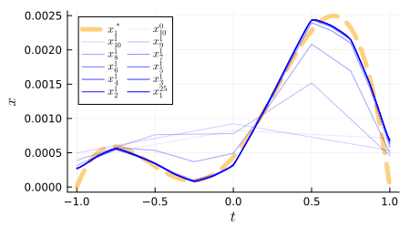
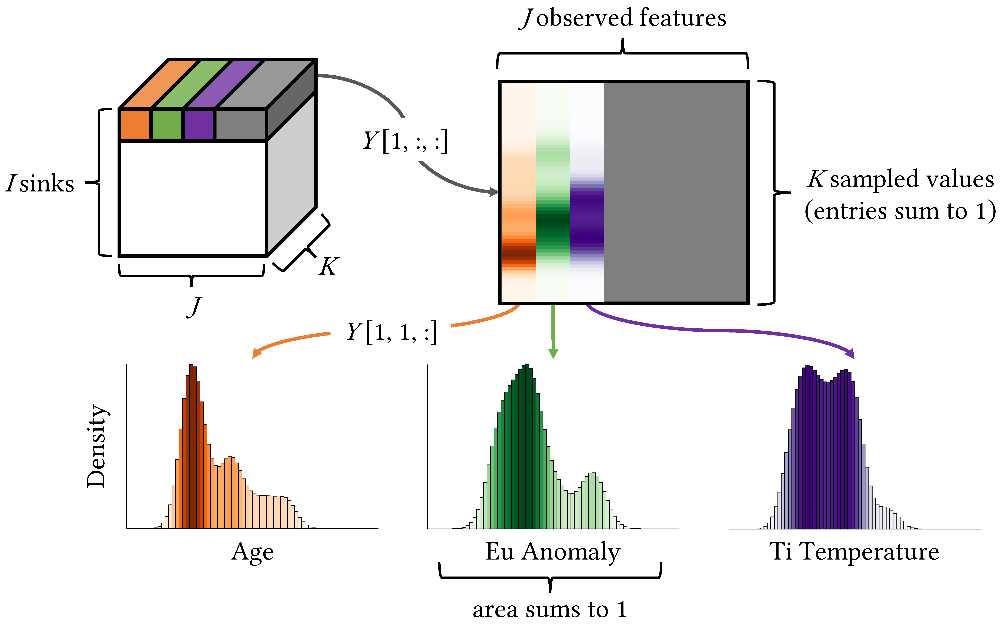
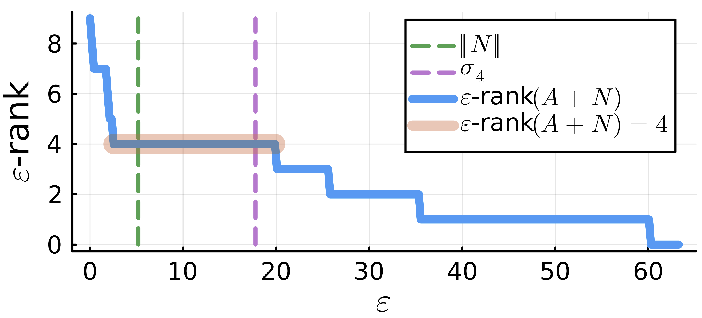
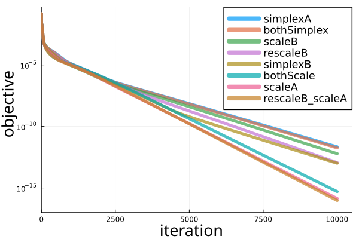
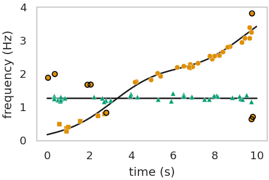

[Curriculum Vitae](files/Nicholas_Richardson_CV.pdf)

<!--
```{=html}
<object data="docs/files/Nicholas_Richardson_Music_CV.pdf" type="application/pdf" width="100%" height="100%" style="min-height:100vh;">
    <p>It appears you don't have a PDF plugin for this browser.
    No biggie... you can <a href="docs/files/Nicholas_Richardson_Music_CV.pdf">click here to
    download the PDF file.</a></p>
</object>
``` -->
## Projects

::: {.grid style="place-items: center;row-gap: 0"}

::: {.g-col-8}
**Multiscale Optimization**:
Optimize over continuous functions at gradually finer discretizations with [greedy multiscale](files/publications/multiscale-paper-and-supplement.pdf)
:::

::: {.g-col-4}

:::

::: {.g-col-4}

:::

::: {.g-col-8}
**Tensor Factorization**:
Input [geological data tensor](http://doi.org/10.1007/s11004-024-10175-0) processed with [BlockTensorFactorization.jl](https://mpf-optimization-laboratory.github.io/BlockTensorFactorization.jl/dev/), a Julia package for constrained tensor factorization
:::

::: {.g-col-8}
**Rank Recovery**:
Estimate rank of a noisy low-rank matrix with [Numerical Epsilon-Rank](https://mpf-optimization-laboratory.github.io/opt-blog/posts/epsilon-rank/)
:::

::: {.g-col-4}

:::

::: {.g-col-4}

:::

::: {.g-col-8}
**Constrained Optimization**:
Comparison of nonnegative
and sum-to-one [constraint enforcing operations](https://mpf-optimization-laboratory.github.io/BlockTensorFactorization.jl/dev/tutorial/constraints/) from slowest (Euclidean Simplex Projection) to fastest (KL-Projection and renormalization) applied to a [matrix factorization problem](https://github.com/MPF-Optimization-Laboratory/BlockTensorFactorization.jl/blob/e4424e219bc960a2ccf481d612560b7043c87df7/example/columnSimplexNMF.jl)
:::

::: {.g-col-8}
**Signal Decomposition**:
Separation of two frequency and amplitude modulated signals using [SRMD: Sparse Random Mode Decomposition](http://doi.org/10.1007/s42967-023-00273-x)
:::

::: {.g-col-4}

:::

:::








<!--Include academic icons or buttons-->
<!-- 

<script src="https://bibbase.org/show?bib=https%3A%2F%2Fbibbase.org%2Fzotero-mypublications%2Fnjericha&jsonp=1"></script> -->

<!-- Notes: \* corresponding author; <sup>GS</sup> graduate student advisee; <sup>VS</sup> visiting scholar; {width=20 fig-alt="Highly cited paper"} ESI [Highly Cited Paper](https://webofscience.help.clarivate.com/en-us/Content/esi-highly-cited-papers.html) (top 1%); {width=20 fig-alt="Hot paper"} ESI [Hot Paper](https://webofscience.help.clarivate.com/en-us/Content/esi-hot-papers.html) (top 0.1%)

Total citations as of January 2025:

- [Web of Science](https://www.webofscience.com): 100,000 (h-index = 100)
- [Google Scholar](https://scholar.google.com/citations?user=qc6CJjYAAAAJ&hl=en): 179,000 (h-index = 127, i10-index = 377)  -->

<!-- ## Selected Work -->

<!-- Einstein, A., Podolsky, B., & Rosen, N. (1935). [Can quantum-mechanical description of physical reality be considered complete?](posts/paper-title/index.qmd). *Physical review*, 47(10), 777. \[[pdf](https://scholar.google.com/)\] \[[code and data](https://doi.org)\] {width=20 fig-alt="Highly cited paper"} {width=20 fig-alt="Hot paper"} <span class="__dimensions_badge_embed__" data-doi="10.1103/PhysRev.47.777" data-style="large_rectangle"></span> <div data-badge-popover="right" data-badge-type="1" data-doi="10.1103/PhysRev.47.777" data-hide-no-mentions="true" class="altmetric-embed"></div>


<center><hr style="width:50%"></center>

Einstein, A. (1965). Concerning an heuristic point of view toward the emission and transformation of light. *American Journal of Physics*, 33(5), 367. [[pdf](https://icg.isy.liu.se/en/phd-courses/quantum_foundations/references/Einstein1905b.pdf)] <span class="__dimensions_badge_embed__" data-doi="10.1038/s41560-023-01304-w" data-style="large_rectangle"></span> <div data-badge-popover="right" data-badge-type="1" data-doi="10.1038/s41560-023-01304-w" data-hide-no-mentions="true" class="altmetric-embed"></div> -->


<!--Include social share buttons-->

<!--  -->
